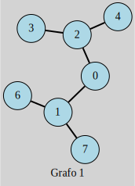
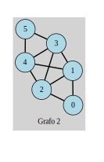

# Compilacion
Se cuenta con un makefile para facilitar la ejecución.

## Limpieza

Se recomienda ejecutar antes de cualquier ejecución
```
make clean
```

## Ejecución del primer grafo
```
make run
8
6
0 1
0 2
2 3
2 4
1 6
1 7

```
> [!CAUTION]
> Incluir el salto de linea

## Ejecución del segundo grafo
```
make run
6
10
0 1
1 2
1 3
2 4
4 3
2 0
4 5
3 5
3 2
4 1

```
> [!CAUTION]
> Incluir el salto de linea y recordar el make clean antes de su ejecucion

## Salidas esperadas

### Grafo 1
```
No Hamiltonian path or cycle exist
No euler's path or circuit exist:'
```

### Grafo 2
```
Hamiltonian path exists
0-1 1-2 2-3 3-4 4-5 

Euler's path exists:
0-1 1-2 2-4 4-3 3-1 1-4 4-5 5-3 3-2 2-0
```

# Definiciones
## Grafos
Estructuras de datos que permiten modelar y resolver problemas del mundo real. Se componen de nodos (vértices) y aristas, las cuales se encargan de relacionar nodos.
### 1. Grafos no dirigidos
Grafo en el que las aristas no tienen una dirección definida. Esto significa que una arista que conecta dos vértices, por ejemplo A y B, se puede recorrer de A a B o de B a A sin que eso cambie el significado o el flujo de trabajo.
### 2. Grafos dirigidos
Grafo en el que las aristas tienen una dirección definida. Esto significa que el recorrido de una arista se realiza desde un nodo de origen a un nodo de destino, y no en la dirección opuesta.
### 3. Grafos Ponderados
Grafos que tienen un peso o un costo de recorrido. Para este tipo de grafo, cada arista tiene asociada un atributo que define el peso o el coste de recorrer dicha arista.
## Euler
### 1. Camino de Euler
Tipo de recorrido que se puede hacer en los diferentes tipos de grafos. Su característica esencial es que en su recorrido se pasa por todas las aristas del grafo una sola vez.
### 2. Circuitos de Euler
Variante de los caminos de Euler. Estos circuitos buscan recorrer un grafo pasando por todas las aristas una sola vez. Su principal diferencia con los caminos de Euler es que en los circuitos de Euler el recorrido inicia desde un vértice en específico, y finaliza en dicho vértice, manteniendo la regla de recorrer cada arista una sola vez.
## Hamilton
### 1. Camino de Hamilton
Tipo de recorrido que se puede hacer en los diferentes tipos de grafos. Su característica esencial es que en su recorrido se pasa por todos los vértices del grafo una sola vez.
### 2. Circuitos de Hamilton
Variante de los caminos de Hamilton. Estos circuitos buscan recorrer un grafo pasando por todos los vértices una sola vez. Su principal diferencia con los caminos de Hamilton es que en los circuitos de Hamilton el recorrido inicia desde un vértice en específico, y finaliza en dicho vértice, manteniendo la regla de recorrer cada vértice una sola vez.
## Algoritmo de Dijkstra
Algoritmo que busca encontrar los caminos más rápidos posibles. En el caso de los grafos, este algoritmo se puede usar en grafos ponderados para poder calcular la mejor ruta de un vértice a otro.
# Casos de grafos
A continuación se presentan los casos de prueba para los grafos y los recorridos mencionados anteriormente. Para cada caso, se evaluará si existe algún camino o circuito de Euler o Hamilton. Todos los casos son grafos no dirigidos.
## 1. Caso uno


## 2. Caso dos

