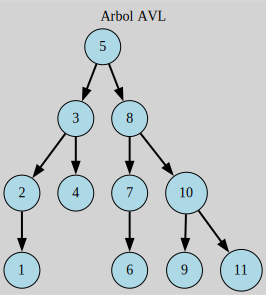

# Arboles AVL

Este tipo de arboles se caracterizan por los siguientes puntos 

1. *Son* autobalanceados, por lo cual su complejidad tiende a ser logaritmica teniendo en cuenta la altura
2. Son estrictamente binarios, por lo que su orden es 



## Complilacion

usando el comando
```
make clean
```
Se limpian los archivos binarios en caso de su existencia

Posteriormente
```
make run
```
Para compilarlo y ejecutarlo
