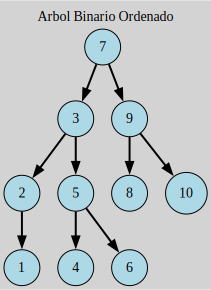

# Arbol binario ordenado

Los arboles binarios poseen las siguientes caracteristicas
1. No son balanceados, por lo cual las operaciones de insercion, eliminacion y busqueda son constantes en la cantidad de nodos
2. Tienen necesariamente un arbol de *2*



## Complilacion

usando el comando
```
make clean
```
Se limpian los archivos binarios en caso de su existencia

Posteriormente
```
make run
```
Para compilarlo y ejecutarlo