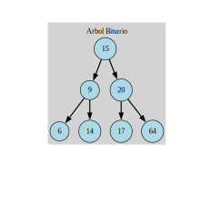

# Arboles binarios

Los arboles binarios cumplen con las siguientes caracteristicas 

1. No son balanceados, por lo cual sus tiempos de insercion, eliminacion y busqueda son lineales
2. Tienen necesariamente un orden *2*



Este es el arbol a partir del cual se realizan las pruebas

## Complilacion

usando el comando
```
make clean
```
Se limpian los archivos binarios en caso de su existencia

Posteriormente
```
make run
```
Para compilarlo y ejecutarlo