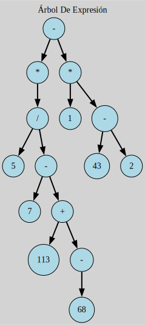

# Arboles de expresion

Este tipo de arboles representan el código en una estructura de datos en forma de arbol donde cada uno de los nodos es una expresion



## Complilacion

usando el comando
```
make clean
```
Se limpian los archivos binarios en caso de su existencia

Posteriormente
```
make run
```
Para compilarlo y ejecutarlo