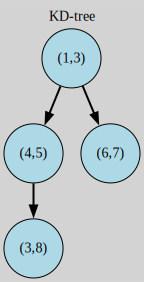

# KD-tree

Este tipo de arboles es una estructura de datos no lineal que organiza puntos en unas dimensiones establecidas



## Complilacion

usando el comando
```
make clean
```
Se limpian los archivos binarios en caso de su existencia

Posteriormente
```
make run
```
Para compilarlo y ejecutarlo