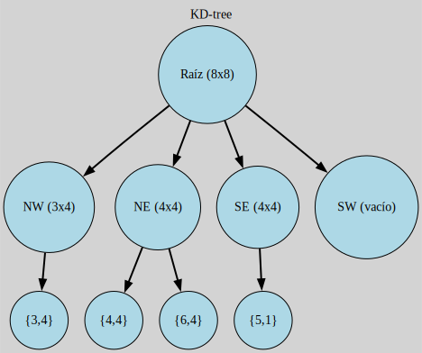

# Quad-tree

Estos arboles se caracterizan por representar generalmente puntos dentro de un espacio cartesiano



## Complilacion

usando el comando
```
make clean
```
Se limpian los archivos binarios en caso de su existencia

Posteriormente
```
make run
```
Para compilarlo y ejecutarlo